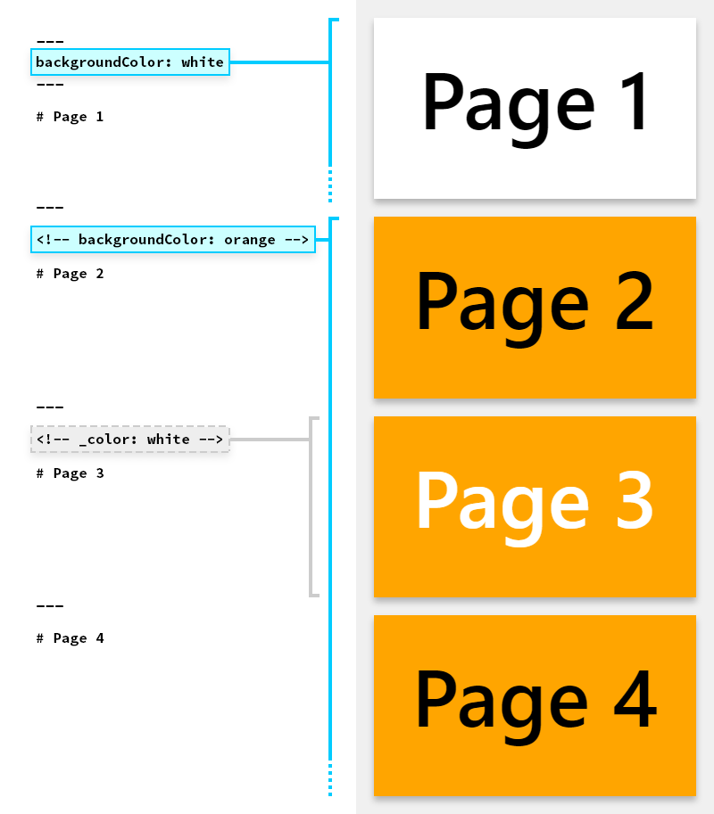
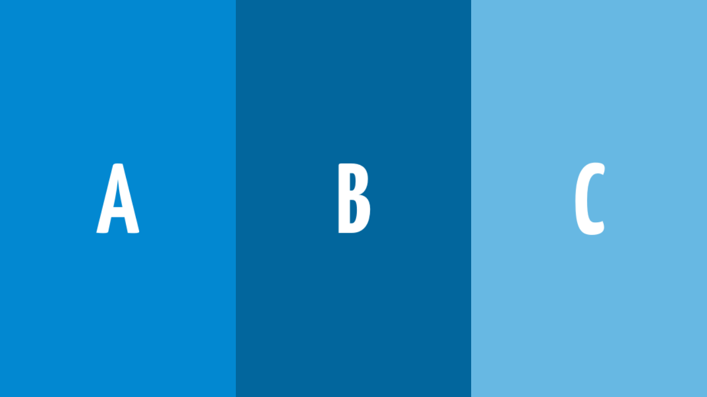
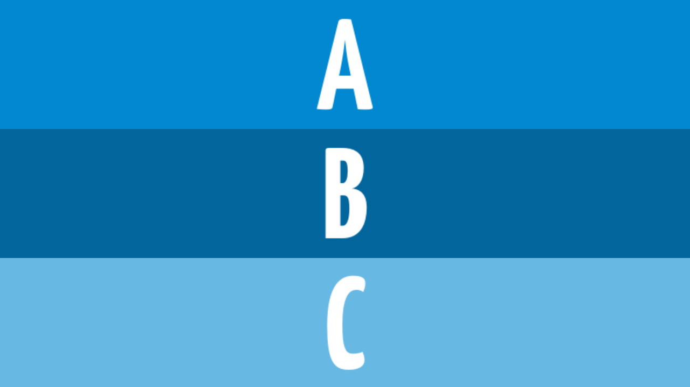
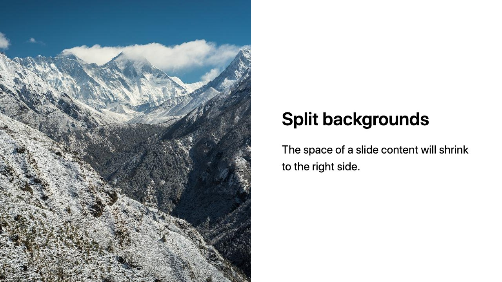
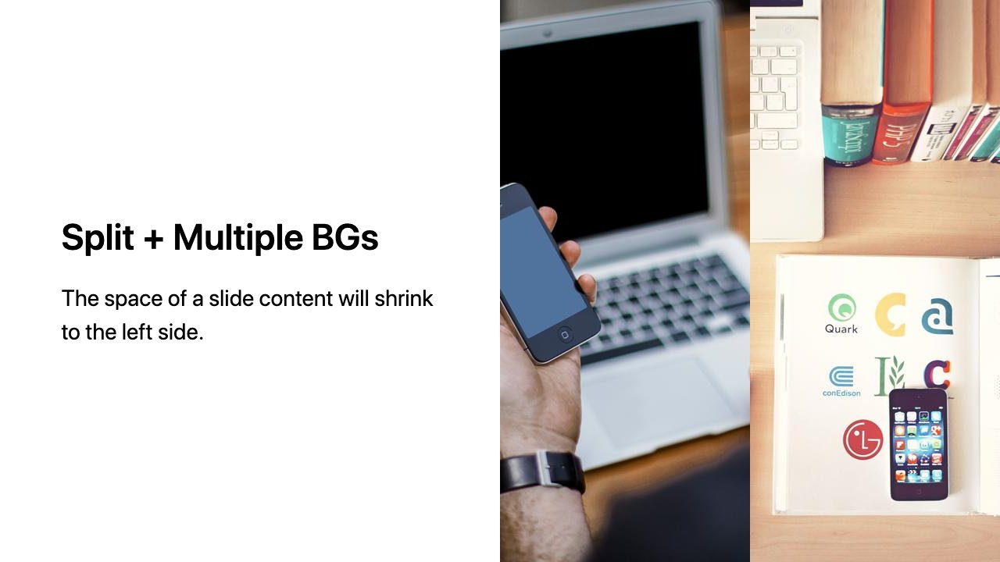
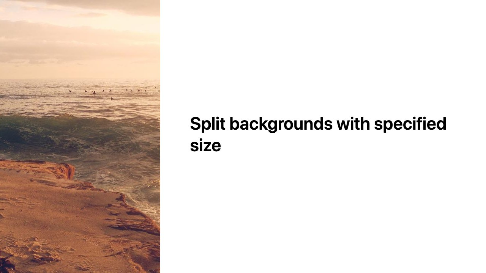

## [#](#用-marp-基于-markdown-制作幻灯片) 用 Marp 基于 markdown 制作幻灯片

Marp, Markdown 演示生态系统，只需聚焦于 markdown 文档编写就可以创建出很漂亮的幻灯片

+ 支持导出 PDF，pptx 等格式文件。
+ 支持 vscode 插件实时展示幻灯片效果图
+ 支持集成到 HTML 页面演示

[Marpit 官方文档](https://marpit.marp.app/markdown)

## [#](#书写文档) 书写文档

## [#](#功能) 功能

+ 在 markdown-it 解析器扩展出额外的功能特性，保持了常规 markdown 文档的兼容性
+ css 主题系统，可以通过 css 自定义演示效果
+ 支持 svg 元素

## [#](#安装) 安装

```js
npm install @marp-team/marpit
```

## [#](#marpit-markdown-编写) Marpit Markdown 编写

1. 分页

通过 `---` 进行手动分页展示

```markdown
# slide 1

foo

---

# slide 2

bar
```

## [#](#指令语法) 指令语法

编写的指令将会解析成 YAML 语法。

### [#](#html-注释) HTML 注释

通过注释，PPT 演讲者模式将会看到这些注释。如果是指令，将不会在演讲者模式显示

```markdown
<!--
theme: default
paginate: true
-->
```

### [#](#front-martter-头信息) front-martter 头信息

可以在 markdown 头部添加元信息。

```markdown
---
theme: default
paginate: true
---
```

### [#](#指令的作用域) 指令的作用域

一个指令默认具有全局的作用域，如果在指令开头添加 `_` 下划线将具有本地作用域，只在当前页幻灯片设置生效

```markdown
<!-- backgroundColor: aqua -->

本页幻灯片具有 aqua 背景颜色

---

这是第二页， 具有相同 aqua 背景颜色

---

<!-- _backgroundColor: red -->

这页是红色背景

---

这页是 squa 背景色
```



### [#](#全局的指令) 全局的指令

TIP

无法通过本地作用域方式声明，只能在头部元信息声明

+ theme

主题设置， 默认主题是 `theme: default` , marp 自带的另一个主题是 `theme: gaia`，可自定义主题。

+ style

样式定制，

```markdown
---
theme: base-theme
style: |
  section {
    background-color: #ccc;
  }
---
```

+ headingDivider

自动分页功能，指定标题级别进行自动分页

```markdown
<!-- headingDivider: 2 -->

# 第一页

这是第一页内容

## 第二页

### 第二页内容

Hello, world!

# 第三页

😃
```

### [#](#本地的指令) 本地的指令

TIP

可以本地作用域方式声明， 全局声明也是支持。

| 指令名             | 说明                                           |
| ------------------ | ---------------------------------------------- |
| paginate           | 如果设置为 `true`，自动显示分页号            |
| \_paginate         | 如果设置为 `false`, 首页分页号不显示         |
| header             | 设置页头信息                                   |
| footer             | 设置脚部（底部）信息                           |
| class              | 设置样式名                                     |
| backgroundColor    | 设置背景色                                     |
| backgroundImage    | 设置背景图（在 markdown 语法设置的背景图底层） |
| backgroundPosition | 设置背景图位置                                 |
| backgroundRepeat   | 设置背景重复样式                               |
| backgroundSize     | 设置背景大小                                   |
| color              | 设置字体颜色                                   |

示例：

```markdown
<!-- backgroundImage: "linear-gradient(to bottom, #67b8e3, #0288d1)" -->
<!-- backgroundImage: "url(./image/back.jpg)" -->

Gradient background

---

<!--
_backgroundColor: black
_color: white
-->

Black background + White text
```

## [#](#图片语法) 图片语法

### [#](#图片大小写) 图片大小写

```markdown
 <!-- 设置宽度为 200px -->
 <!-- 设置高度为 300px -->
 <!-- 设置宽高 -->
 <!-- 支持缩写，设置大小为 32x32 px -->
```

注意

一些关联视图大小的单位(`vw`, `vh`, `vmin`, `vmax`) 不能确保大小不会变化。

### [#](#图片过滤) 图片过滤

| Markdown             | w/ arguments                                   |
| -------------------- | ---------------------------------------------- |
| ``        | ``                             |
| ``  | ``                        |
| ``    | ``                         |
| `` | `` |
| ``   | ``                           |
| ``  | ``                     |
| ``      | ``                           |
| ``     | ``                            |
| ``    | ``                          |
| ``       | ``                             |

例如：

```markdown

```

### [#](#幻灯片背景) 幻灯片背景

```md

```

### [#](#背景大小) 背景大小

```md

```

| 关键字  | 说明                             | 例子                       |
| ------- | -------------------------------- | -------------------------- |
| cover   | 缩放大小填充整页幻灯片 (Default) | !\[bg cover\](image.jpg)   |
| contain | 缩放大小适应整页幻灯片           | !\[bg contain\](image.jpg) |
| fit     | contain 别名, 兼容 Deckset.      | !\[bg fit\](image.jpg)     |
| auto    | 使用原始大小                     | !\[bg auto\](image.jpg)    |
| x%      | 指定缩放百分比                   | !\[bg 150%\](image.jpg)    |

### [#](#多张背景) 多张背景

默认 horizontal 布局

```md


```



+ 使用 `vertical` 布局

```md


```



### [#](#背景文字分离) 背景文字分离

```md


# Split backgrounds

这段幻灯片内容在背景图右边。
```



### [#](#多张背景图片和文字分离) 多张背景图片和文字分离

```md


# Split + Multiple BGs

The space of a slide content will shrink to the left side.
```



### [#](#背景文字分离指定大小) 背景文字分离指定大小

```md


# Split backgrounds with specified size
```



### [#](#设置背景简写方式) 设置背景简写方式

```md
# Hex color (White BG + Black text)


---

# Named color (rebeccapurple BG + White text)


---

# RGB values (Orange BG + White text)

>)
>)
```

## [#](#列表展示) 列表展示

### [#](#无序列表) 无序列表

```md
# 直接全部显示

- One
- Two
- Three

---

# 动态展示，一个个显示

* One
* Two
* Three
```

### [#](#有序列表) 有序列表

```md
# 直接全部显示

1. One
2. Two
3. Three

---

# 动态展示，一个个显示

1) One
2) Two
3) Three
```

## [#](#主题-css) 主题 CSS

每页幻灯片都是通过 `section` 元素包含内容

```html
<section><h1>First page</h1></section>
<section><h1>Second page</h1></section>
```

### [#](#全局style-和-scoped-本地作用域-style) 全局style 和 scoped 本地作用域 style

```md
<!-- 全部页面生效 style -->
<style>
h1 {
  color: red;
}
</style>

# Red text

---

<!-- Scoped style；只有本页幻灯片生效 -->
<style scoped>
h1 {
  color: blue;
}
</style>

# Blue text (only in the current slide page)

---

# Red text

```

### [#](#创建主题-css-文件) 创建主题 css 文件

第一行必须加上主题名称，通过 `@theme` 声明

```css
/* @theme marpit-theme */

section {
  width: 1280px;
  height: 960px;
  font-size: 40px;
  padding: 40px;
}

h1 {
  font-size: 60px;
  color: #09c;
}

h2 {
  font-size: 50px;
}

```

### [#](#root-root伪类-与-section-是同一个意思) `:root` root伪类 与 `section` 是同一个意思

```css
/* @theme marpit-theme */

:root {
  width: 1280px;
  height: 960px;
  font-size: 40px;
  padding: 1rem;
}

h1 {
  font-size: 1.5rem;
  color: #09c;
}

h2 {
  font-size: 1.25rem;
}

```

### [#](#幻灯片大小比例) 幻灯片大小比例

默认是 `1280x720` 像素。通过 `section` 或者 `:root` 进行配置

```css
/* Change to the classic 4:3 slide */
section {
  width: 960px;
  height: 720px;
}
```

注意

幻灯片大小比例改变必须使用绝对单位，支持 cm, in, mm, pc, pt, px

### [#](#分页样式) 分页样式

通过 `section::after` 或 `:root::after` 进行设置。

```css
/* Styling page number */
section::after {
  font-weight: bold;
  text-shadow: 1px 1px 0 #fff;
}
```

自定义显示页码

+ `attr(data-marpit-pagination)` 当前页码
+ `attr(data-marpit-pagination-total)` 总页数

```css
/* Add "Page" prefix and total page number */
section::after {
  content: 'Page ' attr(data-marpit-pagination) ' / ' attr(data-marpit-pagination-total);
}
```

### [#](#import-引入其他css) `@import` 引入其他css

```css
/* @theme customized */

/* 引入base css文件 */
@import 'base';

section {
  background-color: #f80;
  color: #fff;
}
```

### [#](#import-theme-引入其他主题-scss文件) `@import-theme` 引入其他主题, scss文件

```scss
$bg-color: #f80;
$text-color: #fff;

/* 引入其他主题 */
@import-theme 'default';

section {
  background: $bg-color;
  color: $text-color;
}

```
